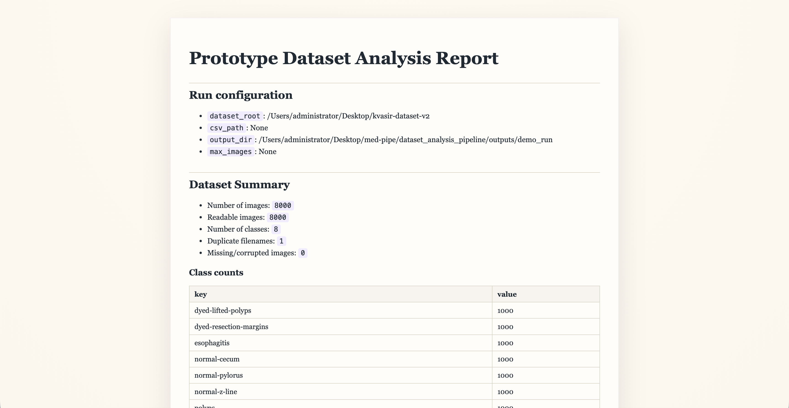
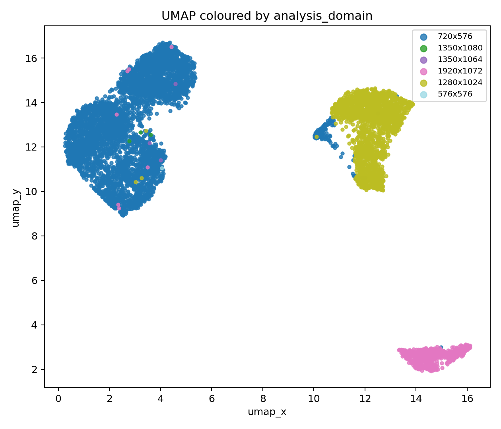
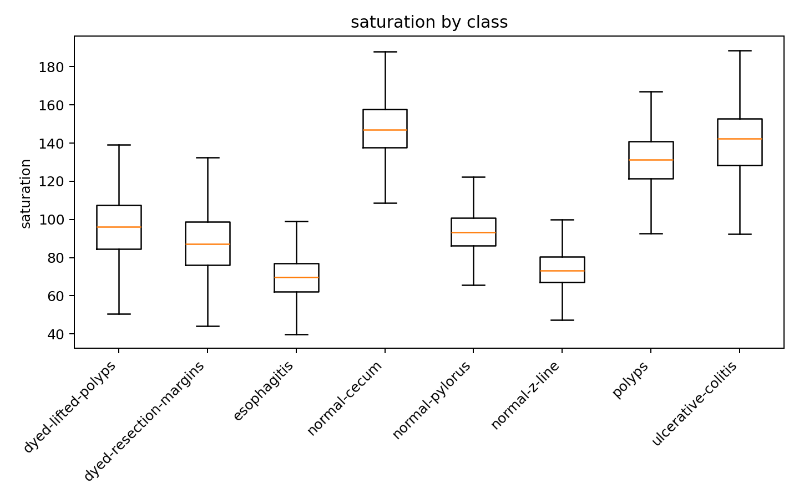

# Dataset Analysis Pipeline

Prototype Python project for exploratory analysis of image datasets in the style of an early-stage organ-assessment startup. The focus is dataset diagnostics rather than classifier training: quality auditing, shortcut-learning risk, outlier review, embedding exploration, and demo-ready reporting.



## Why This Exists

This project is designed for the first technical pass you might run on a kidney, liver, or related image dataset before building any production model stack.

Questions it is meant to answer:

- What is in the dataset, and how clean is it?
- Are classes balanced?
- Do acquisition conditions create shortcut-learning risk?
- Which images look corrupted, duplicated, suspicious, or out-of-distribution?
- Do learned embeddings cluster by label or by image quality / acquisition artefacts?

The code is dataset-agnostic and supports:

- folder-per-class datasets
- CSV manifests with image paths, labels, and optional metadata

## Example Outputs

Kvasir proxy dataset: embedding structure coloured by inferred analysis domain.



Kvasir proxy dataset: per-class saturation shifts that can signal shortcut-learning risk.



Kvasir proxy dataset: top suspicious samples flagged by the outlier stage.


Oxford-IIIT Pet: near-duplicate candidates for manual review.


## Recommended Stand-In Datasets

Medical-style proxy:

- `Kvasir v2` or related Kvasir variants. This is the stronger stand-in for acquisition variability and shortcut-learning analysis because image appearance and capture setup vary in ways that resemble cross-site medical data issues.

Non-medical validation dataset:

- `Oxford-IIIT Pet`. This is useful for validating that the pipeline behaves sensibly on a clean public dataset, but its `species` metadata is a semantic superclass, not a true acquisition domain.

Important for Oxford Pets:

- The dataset root is not folder-per-class.
- Do not point `--dataset-root` at the raw Oxford Pets root, because that mixes RGB images with segmentation trimaps.
- Use `prepare_oxford_pets.py` to build a CSV manifest first.

## Repository Layout

```text
dataset_analysis_pipeline/
  README.md
  requirements.txt
  config.py
  run_analysis.py
  demo_end_to_end.py
  export_report.py
  prepare_oxford_pets.py
  data/
  images/
  outputs/
  src/
    __init__.py
    data_loader.py
    dataset_summary.py
    duplicate_detection.py
    image_quality.py
    bias_analysis.py
    embeddings.py
    outlier_detection.py
    visualizations.py
    multiview_placeholder.py
    utils.py
```

## Setup

```bash
cd /Users/administrator/Desktop/med-pipe/dataset_analysis_pipeline
python3.11 -m venv .venv
source .venv/bin/activate
pip install -r requirements.txt
```

## Running The Pipeline

Folder-per-class dataset:

```bash
python run_analysis.py \
  --dataset-root /absolute/path/to/my_dataset \
  --output-dir outputs/demo_run
```

CSV-based dataset:

```bash
python run_analysis.py \
  --csv-path /absolute/path/to/metadata.csv \
  --path-root /absolute/path/to/image_root \
  --image-column image_path \
  --label-column label \
  --source-column source_domain \
  --output-dir outputs/csv_run
```

Oxford-IIIT Pet:

```bash
python prepare_oxford_pets.py \
  --dataset-root /absolute/path/to/oxford-iiit-pet

python run_analysis.py \
  --csv-path /absolute/path/to/oxford-iiit-pet/pets_manifest.csv \
  --path-root /absolute/path/to/oxford-iiit-pet/images \
  --image-column image_path \
  --label-column label \
  --source-column species \
  --output-dir outputs/oxford_pets_csv
```

Export a finished report to HTML:

```bash
python export_report.py \
  --input-md outputs/demo_run/final_report.md
```

## What The Pipeline Does

### 1. Data ingestion

- Loads folder-per-class datasets or CSV manifests
- Builds a dataframe with path, label, image size, file size, readability status, and metadata
- Preserves source metadata when available
- Falls back to an inferred `analysis_domain` when explicit source metadata is missing

### 2. Dataset summary

- Image count
- Class count
- Class distribution
- Image size distribution
- Aspect ratio distribution
- Duplicate filename check
- Corrupted image log

### 3. Image quality analysis

Per-image metrics:

- brightness
- contrast
- blur score via Laplacian variance
- saturation
- near-white pixel ratio
- bright connected regions
- entropy

Outputs:

- histograms
- per-class comparison plots
- ranked CSVs for highest / lowest images per metric
- montages of extreme examples

### 4. Bias and shortcut-learning analysis

Frames dataset differences as possible hidden shortcut signals:

- one class consistently brighter or blurrier
- one class concentrated in one analysis domain
- one class concentrated in one inferred acquisition proxy
- embedding structure driven by quality or acquisition rather than label

### 5. Duplicate detection

- computes lightweight perceptual hashes
- exports exact hash-match groups as strong duplicate candidates
- exports near-duplicate pairs using Hamming thresholds
- saves a montage of likely duplicate candidates

### 6. Embedding analysis

- extracts 512-D embeddings with `torchvision` `ResNet18`
- uses ImageNet-pretrained weights when available
- runs PCA and UMAP, with t-SNE fallback if UMAP is unavailable
- writes 2D plots coloured by label, brightness, blur, and analysis domain

### 7. Outlier analysis

Combines:

- isolation forest on quality features
- nearest-neighbour distance in embedding space
- class-centroid distance in embedding space

This is intended as a prototype for detecting:

- non-class inputs
- acquisition failures
- unusual samples
- possible labeling mistakes

### 8. Multi-view placeholder

Includes a clean extension point for future work on:

- multi-view coverage analysis
- missing viewpoint detection
- case-level grouping
- reconstruction-oriented ideas such as sparse geometry or Gaussian-splatting-inspired workflows

## Main Output Files

Typical outputs in `outputs/<run_name>/`:

- `dataset_manifest.csv`
- `dataset_manifest_with_quality.csv`
- `dataset_manifest_with_embeddings.csv`
- `dataset_manifest_final.csv`
- `dataset_summary.md`
- `bias_analysis.md`
- `duplicate_detection.md`
- `final_report.md`
- `final_report.html` after export
- plots under `quality/` and `embeddings/`
- candidate tables such as `near_duplicate_pairs.csv`, `top_suspicious_samples.csv`, and `suspicious_shortcut_signals.csv`

## How To Interpret The Two Demo Datasets

Kvasir:

- best for demonstrating acquisition variability and shortcut-learning risk
- more relevant to a medical imaging startup narrative
- useful for showing how quality and capture conditions can entangle with label

Oxford-IIIT Pet:

- useful for sanity-checking the pipeline on a cleaner public dataset
- good for duplicate detection and basic embedding exploration
- less useful as a proxy for true acquisition-domain bias

## Swapping In A Real Medical Dataset

To apply this to a real kidney or liver dataset later:

1. Keep image paths and labels in either a folder-per-class layout or a CSV manifest.
2. Include acquisition metadata if you have it, such as site, device, room, operator, or protocol.
3. Point `run_analysis.py` at the dataset.
4. Extend the quality or bias modules for domain-specific signals, such as colour calibration, ruler presence, organ masking, or background quality checks.

## Practical Notes

- The pipeline is CPU-friendly for modest public datasets and subsets.
- Embedding extraction is usually the slowest stage.
- UMAP is optional; the pipeline falls back if it is unavailable.
- No classifier training pipeline is included on purpose. The goal is exploratory data analysis and dataset auditing.

## Future Extensions

- embedding-based near-duplicate search at larger scale
- explicit segmentation-aware quality metrics
- donor/site/device fairness reports
- uncertainty-aware OOD scoring
- case-level multi-view coverage scoring
- report templates tailored to transplant or clinical review workflows
